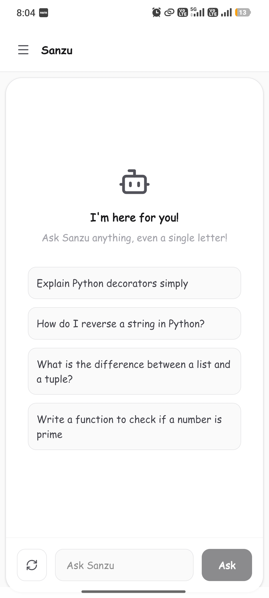
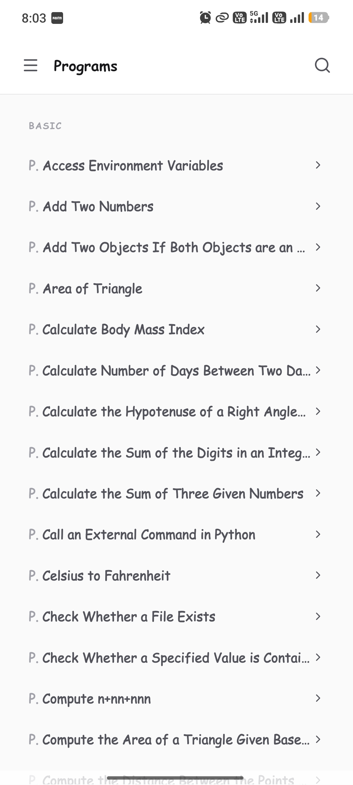
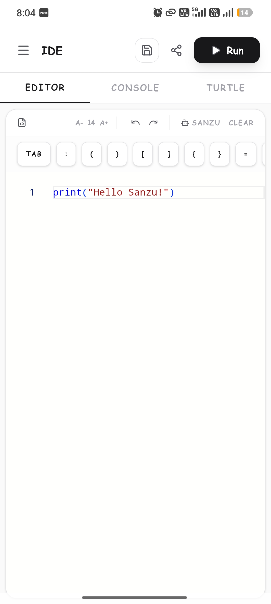
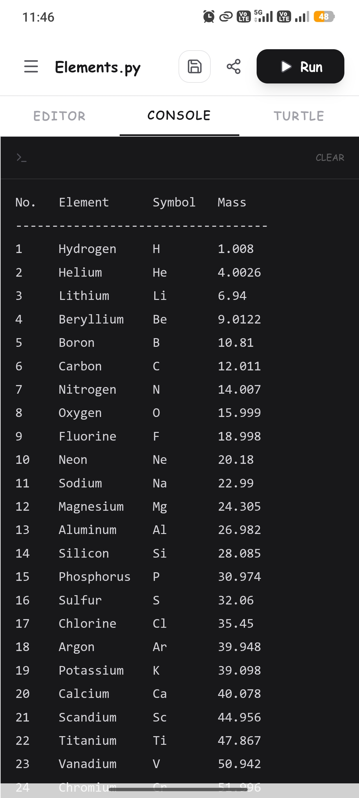
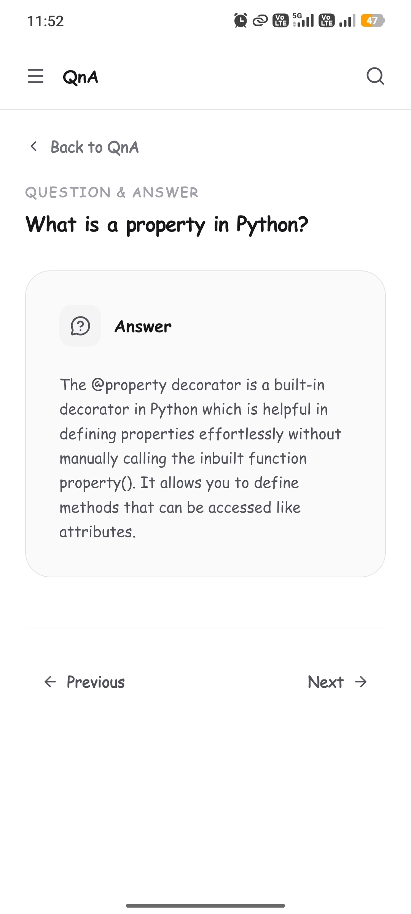

# Sanzu App
Python notes and IDE application for Android devices

  

## Download "Sanzu"
This app combines comprehensive Python notes with a built‑in compiler, so you can study and practice anywhere, without an internet connection.

  

**How to Use:**
- `Download` the appropriate version for your device.
- `Install` the app (on Android, allow installation from `unknown sources` if needed).
- `Open` the app and start exploring `Python notes` or use the `compiler`.
- Write your code in the `editor`, tap `Run`, and see the `output` instantly.

## Screenshots
Discover the sleek, user-friendly interface of Sanzu. Swipe through the application screens to see the IDE, interactive Python notes, and the built-in AI assistant in action.

  
  
  
  
  
  
  
  
  
  

---

## Release: Sanzu v1.2
We are excited to announce the release of Sanzu v1.2! This update introduces the brand-new Sanzu AI, major compiler speed improvements, expanded study materials, and critical stability fixes to enhance your Python coding experience.

## What's New
1. **Sanzu AI:** Meet your new built-in Python assistant. You can now ask questions, get instant explanations, and debug your code directly within the app.

2. **Global Search:** Find anything instantly. Search across notes, examples, and articles from a single unified search bar.

3. **PIP Installer:** Install any Python package directly from within Sanzu — no terminal required.

4. **Dark Mode:** Sanzu now features a full dark theme across notes, compiler, and AI — easier on the eyes during those late-night coding sessions.

Added 150+ new comprehensive topics covering advanced concepts like decorators, generators, and list comprehensions.

## Improvements
**Faster Compiler:** Code execution is now up to 2× faster, featuring significantly improved output rendering for a smoother IDE experience and Turtle graphics.

## Bug Fixes
**Startup Stability:** Resolved a critical crash that affected some `Android 12` devices during a cold start.

Full Changelog: https://github.com/heysanzu/sanzu/commits/Sanzu_v1.2

---

## Contribution & Feedback
If you enjoy Sanzu, please consider

**Reporting Issues:** If you encounter a crash or bug, please open an issue in this repository.

**Suggesting Topics:** Have a Python concept you want to see explained in the "Notes" section? Open a Pull Request or a discussion.

## License
© 2026-27 Sanzu. All rights reserved.

Maintained by [@heysanzu](https://github.com/heysanzu) and [@shahnewazbite](https://github.com/shahnewazbite)
